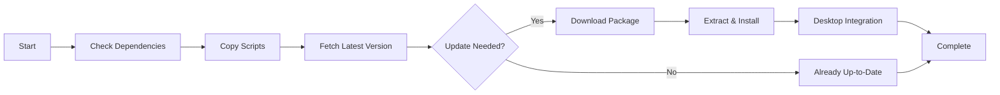

<div align="center">

# 🚀 NeuroForge


[](https://opensource.org/licenses/MIT)
[](https://www.gnu.org/software/bash/)
[](https://www.linux.org/)
[](http://makeapullrequest.com)
[](https://github.com/hammam999/kiro-ide-linux/graphs/commit-activity)

**Forge Your AI Development Environment**

[Features](#-features) • [Quick Start](#-quick-start) • [Installation](#-installation) • [Usage](#-usage) • [Contributing](#-contributing)

</div>

---

## 📖 About

**NeuroForge** is a comprehensive toolkit that provides **automated installation scripts** for AI-powered IDEs on Linux systems. Install **Kiro IDE** and **Windsurf IDE** with a single command, complete with automatic updates, dependency management, and desktop integration.

### 🎯 Supported IDEs

<table>
<tr>
<td align="center" width="50%">

### 🔷 Kiro IDE


**AI-Powered Development Environment**

✨ Smart code completion  
🤖 AI assistance  
⚡ Lightning-fast performance  

</td>
<td align="center" width="50%">

### 🌊 Windsurf IDE


**The First Agentic IDE**

🚀 Advanced AI agents  
🎯 Context-aware coding  
💡 Intelligent suggestions  

</td>
</tr>
</table>

---

## ✨ Features

<div align="center">

| Feature | Description |
|---------|-------------|
| 🎨 **Interactive Menu** | Beautiful CLI interface with color-coded options |
| 🔄 **Auto Updates** | Intelligent version detection and seamless updates |
| 📦 **Dependency Management** | Automatic installation of required packages |
| 🖥️ **Desktop Integration** | Application menu entries with icons |
| 👤 **User & System Install** | Choose between user-only or system-wide installation |
| 🛡️ **Safe Uninstall** | Clean removal with optional config backup |
| 🌐 **Multi-Distro Support** | Works on Ubuntu, Fedora, Arch, openSUSE, and more |
| ⚙️ **Configurable** | Multiple command-line options for advanced users |

</div>

---

## Quick Start

### One-Command Installation

```bash
curl -fsSL https://raw.githubusercontent.com/hammam999/NeuroForge/main/clone-and-install.sh | bash
```


### Interactive Installation (Recommended)

```bash
# Download the installer
wget https://raw.githubusercontent.com/hammam999/NeuroForge/main/clone-and-install.sh

# Make it executable
chmod +x clone-and-install.sh

# Run the installer
./clone-and-install.sh
```

### GUI Installation (User-Friendly)

```bash
# Download the GUI installer
wget https://raw.githubusercontent.com/hammam999/kiro-windsrf-installr/main/gui-installer.sh

# Make it executable
chmod +x gui-installer.sh

# Run the GUI installer
./gui-installer.sh
```

The GUI installer provides a beautiful graphical interface using `whiptail` or `dialog`.

**Alternative: Double-Click Installation**

For easier access, you can use the `.desktop` file:

```bash
# Download the desktop file
wget https://raw.githubusercontent.com/hammam999/kiro-windsrf-installr/main/AI-IDEs-Installer.desktop

# Make it executable and trusted
chmod +x AI-IDEs-Installer.desktop
gio set AI-IDEs-Installer.desktop metadata::trusted true

# Now you can double-click the file to run the installer!
```

### Plugin Management

```bash
# Download the plugin manager
wget https://raw.githubusercontent.com/hammam999/kiro-windsrf-installr/main/plugin-manager.sh

# Make it executable
chmod +x plugin-manager.sh

# Run the plugin manager
./plugin-manager.sh
```

Manage plugins and extensions for your IDEs:
- 📦 Browse available plugins
- ⬇️ Install plugins
- 🗑️ Uninstall plugins
- 📋 List installed plugins
- 🔄 Update all plugins
- 🔍 Search plugins

---

## 📥 Installation

### Prerequisites

- **Linux** (any modern distribution)
- **Bash** 4.0+
- **curl** or **wget**
- **git**

### Installation Options

#### 🎯 Interactive Menu (Easiest)

```bash
./clone-and-install.sh
```

Select from the beautiful menu:
1. Install Kiro IDE
2. Install Windsurf IDE
3. Install Both IDEs
0. Exit

#### 👤 User-Only Installation (No sudo required)

```bash
./clone-and-install.sh --user
```

Installs to `~/.local/share/` without requiring administrator privileges.

#### 🔄 Force Reinstall

```bash
./clone-and-install.sh --force
```

Reinstalls even if the latest version is already installed.

#### 🗑️ Uninstall

```bash
./clone-and-install.sh --uninstall
```

Add `--clean` to also remove user configurations:

```bash
./clone-and-install.sh --uninstall --clean
```

---

## 💻 Usage

### Command-Line Options

```bash
./clone-and-install.sh [OPTIONS]
```

| Option | Description |
|--------|-------------|
| `--user` | Install for current user only (no sudo required) |
| `--force` | Force reinstall even if same version exists |
| `--uninstall` | Uninstall selected IDE |
| `--clean` | Remove user data during uninstall |
| `--help` | Display help message |

### Examples

```bash
# Interactive installation
./clone-and-install.sh

# User-only installation (no sudo)
./clone-and-install.sh --user

# Force reinstall latest version
./clone-and-install.sh --force

# Uninstall with config cleanup
./clone-and-install.sh --uninstall --clean

# User installation with force update
./clone-and-install.sh --user --force
```

---

## 🏗️ Project Structure

```
kiro-windsrf-installr/
├── 📄 clone-and-install.sh       # Main unified installer (CLI)
├── 📄 gui-installer.sh           # GUI installer (whiptail/dialog)
├── 📄 plugin-manager.sh          # Plugin/Extension manager
├── 📄 install-kiro.sh            # Kiro IDE installer
├── 📄 install-windsurf.sh        # Windsurf IDE installer
├── 🖼️ Kiro_1024x1024x32.png      # Kiro icon
├── 🖼️ windsurf.png               # Windsurf icon
├── 📖 README.md                  # This file
├── 📜 LICENSE                    # MIT License
└── 📋 CHANGELOG.md               # Version history
```

---

## 🔧 How It Works

### Installation Process



### Update Detection

The installer automatically:
1. Fetches metadata from official sources
2. Compares installed version with latest
3. Only downloads if update is available
4. Backs up configurations before updating

---

## 🌍 Supported Distributions

<div align="center">

| Distribution | Package Manager | Status |
|--------------|----------------|--------|
| Ubuntu / Debian | `apt` | ✅ Tested |
| Fedora | `dnf` | ✅ Tested |
| CentOS / RHEL | `yum` | ✅ Tested |
| Arch Linux | `pacman` | ✅ Tested |
| openSUSE | `zypper` | ✅ Tested |
| Manjaro | `pacman` | ✅ Tested |
| Pop!_OS | `apt` | ✅ Tested |

</div>

---

## 🤝 Contributing

Contributions are welcome! Please feel free to submit a Pull Request.

### How to Contribute

1. 🍴 Fork the repository
2. 🔨 Create your feature branch (`git checkout -b feature/AmazingFeature`)
3. ✅ Commit your changes (`git commit -m 'Add some AmazingFeature'`)
4. 📤 Push to the branch (`git push origin feature/AmazingFeature`)
5. 🎉 Open a Pull Request

See [CONTRIBUTING.md](CONTRIBUTING.md) for detailed guidelines.

---

## 📝 License

This project is licensed under the MIT License - see the [LICENSE](LICENSE) file for details.

---

## 🙏 Acknowledgments

- **Kiro IDE** - For creating an amazing AI-powered development environment
- **Windsurf IDE** - For pioneering agentic IDE technology
- **Community Contributors** - For testing and feedback

---

## 📞 Support

- 🐛 **Issues**: [GitHub Issues](https://github.com/hammam999/kiro-ide-linux/issues)
- 💬 **Discussions**: [GitHub Discussions](https://github.com/hammam999/kiro-ide-linux/discussions)
- 📧 **Email**: support@example.com

---

## 📊 Statistics

<div align="center">


</div>

---

## 🗺️ Roadmap

- [x] Kiro IDE installer
- [x] Windsurf IDE installer
- [x] Unified installer with menu
- [x] Auto-update functionality
- [x] Desktop integration
- [x] GUI installer
- [x] Plugin management
- [ ] Configuration sync
- [ ] Docker support
- [ ] Web-based installer

---

<div align="center">

**Made with ❤️ by the Community**

[⬆ Back to Top](#-neuroforge)

</div>
